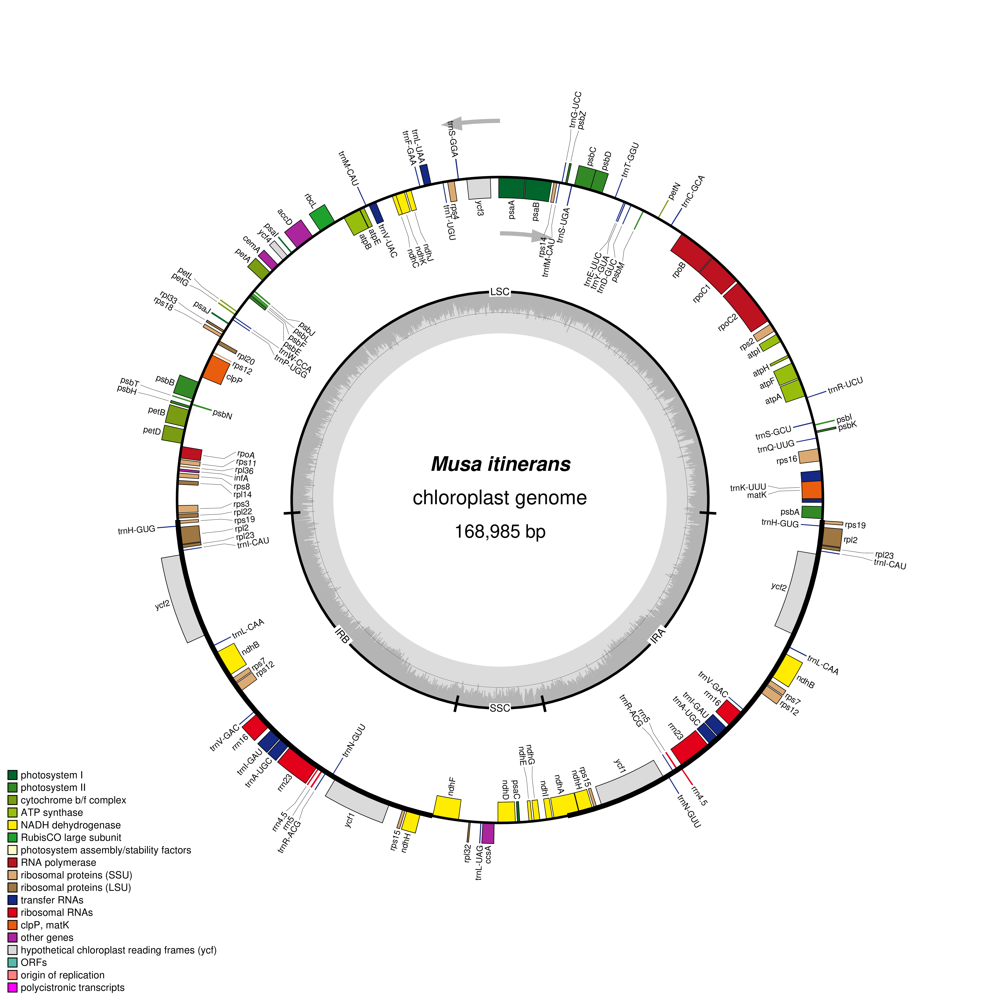

# Visualize Plastid Genome Structure

## Student Information

**Name:** Rachelle May A. Itom  
**Program/Course:** BS Biology  
**Section:** A

## Selected Plant

**Scientific name:** *Musa itinerans*  
**NCBI accession number:** NC_035723.1  
**Plastid genome length:** 168,985 bp

## Source of Genome File

The annotated chloroplast GenBank file was obtained from the NCBI database under accession **NC_035723.1**. The file used for the visualization was:

`Musa_itinerans_NC_035723.1.gb`

## Software Used

The plastid genome was visualized using **OrganellarGenomeDRAW (OGDRAW)**.

## OGDRAW Settings

The genome was visualized using the following settings:

- Standard map mode
- Circular genome map
- Plastid as the sequence source
- Automatic inverted repeat detection
- GC content graph enabled
- Direction of transcription enabled
- Full legend enabled
- Intron-containing genes labeled with an asterisk
- PNG output format
- Fine resolution

## Plastid Genome Map

## Main Structural Features Observed

The *Musa itinerans* chloroplast genome has a typical circular plastid genome organization consisting of a Large Single-Copy (LSC) region, a Small Single-Copy (SSC) region, and two Inverted Repeat regions (IRa and IRb). The map shows protein-coding genes, tRNA genes, and rRNA genes distributed around the genome. Genes are oriented in different directions, as indicated by the arrows showing the direction of transcription. The GC content graph shows variation in GC content across different regions of the plastid genome.

## Answers

The answers to the questions for this laboratory activity are provided in:

`answers/Lab_plastid_genome_answers.md`

## Files

- `data/Musa_itinerans_NC_035723.1.gb` — annotated GenBank file used for visualization
- `figures/Musa_itinerans_plastid_map.png` — OGDRAW plastid genome map
- `answers/Lab_plastid_genome_answers.md` — answers to Questions 1–10
